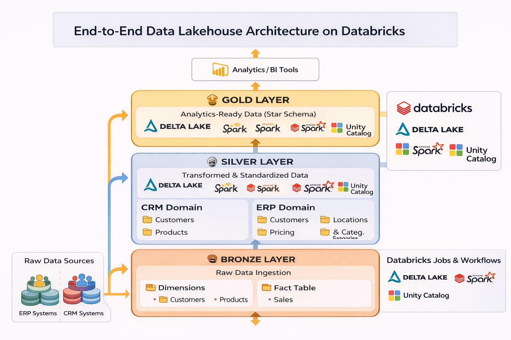
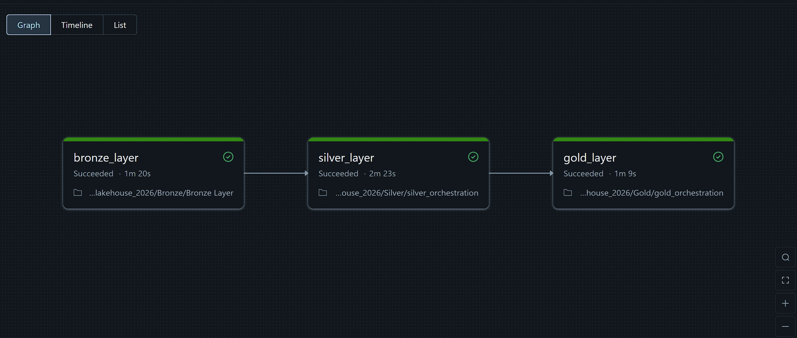

# End-to-End Data Lakehouse Architecture on Databricks  

Modern Medallion Architecture using **Databricks, Delta Lake, Spark SQL & PySpark**  
From raw ERP/CRM data to analytics-ready dimensional model.

---

## Project Overview

This project demonstrates the implementation of a **modern Data Lakehouse architecture** using Databricks.

The objective is to:

- Ingest raw data from multiple enterprise systems (ERP & CRM)
- Transform and standardize data using Spark
- Build a dimensional model (Fact & Dimensions)
- Orchestrate pipelines using Databricks Workflows
- Deliver analytics-ready datasets for BI consumption

This project replicates the same business logic implemented previously in my SQL-based Data Warehouse project (MS SQL Server), but re-engineered using a **scalable Lakehouse architecture**.

🔗 Previous Full SQL Version:  
https://github.com/Fedi-AB/SQL_Data_Warehouse_Project  

---

# Architecture – Medallion Model

The project follows the Medallion architecture pattern:

            ┌─────────────────────────────┐
            │        Raw Data Sources     │
            │     (ERP + CRM Systems)     │
            └──────────────┬──────────────┘
                           │
                           ▼
                  BRONZE LAYER
          (Raw ingestion - Delta format)
                           │
                           ▼
                  SILVER LAYER
      (Cleaned & standardized transformations)
       ├── CRM domain
       └── ERP domain
                           │
                           ▼
                  GOLD LAYER
      (Dimensional model - Fact & Dimensions)
                           │
                           ▼
                  Analytics / BI Tools

---

This project implements a complete Medallion Architecture (Bronze → Silver → Gold)
using Databricks, Spark SQL, PySpark and Delta Lake.

---

# Project Structure

                            ┌──────────────────────┐
                            │   ERP & CRM Systems  │
                            └──────────┬───────────┘
                                       │
                                       ▼
                    ┌─────────────────────────────────────┐
                    │             BRONZE LAYER            │
                    │          Raw Data Ingestion         │
                    │                                     │
                    │        • Bronze_Layer.ipynb         │
                    └──────────────────┬──────────────────┘
                                       │
                                       ▼
                    ┌─────────────────────────────────────┐
                    │            SILVER LAYER             │
                    │    Transformed & Standardized Data  │
                    │                                     │
                    │   CRM Domain                        │
                    │     • silver_crm_cust_info.ipynb    │
                    │     • silver_crm_prd_info.ipynb     │
                    │     • silver_crm_sales_details.ipynb│
                    │                                     │
                    │   ERP Domain                        │
                    │     • silver_erp_cust_az12.ipynb    │
                    │     • silver_erp_loc_a101.ipynb     │
                    │     • silver_erp_px_cat_g1v2.ipynb  │
                    │                                     │
                    │   silver_orchestration.ipynb        │
                    └──────────────────┬──────────────────┘
                                       │
                                       ▼
                    ┌─────────────────────────────────────┐
                    │             GOLD LAYER              │
                    │  Analytics-Ready Data (Star Schema) │
                    │                                     │
                    │   • gold_dim_customers.ipynb        │
                    │   • gold_dim_products.ipynb         │
                    │   • gold_fact_sales.ipynb           │
                    │   • gold_orchestration.ipynb        │
                    └──────────────────┬──────────────────┘
                                       │
                                       ▼
                        ┌──────────────────────────────┐
                        │        Analytics / BI        │
                        │        (Power BI, SQL)       │
                        └──────────────────────────────┘

---

# Bronze Layer – Raw Data Ingestion

Notebook:  
 https://github.com/Fedi-AB/Data_LakeHouse_Project_Databricks/blob/main/bike_lakehouse_2026/Bronze/Bronze%20Layer.ipynb 

Purpose:
- Ingest raw ERP & CRM data
- Store data in Delta format
- Preserve raw structure
- Enable schema enforcement

Key concepts used:
- Spark SQL
- PySpark
- Delta Lake
- Append ingestion strategy

This layer guarantees traceability and replay capability.

---

# Silver Layer – Data Transformation

The Silver layer standardizes, cleans and enriches ERP & CRM datasets.

## 🔹 CRM Transformations

- https://github.com/Fedi-AB/Data_LakeHouse_Project_Databricks/blob/main/bike_lakehouse_2026/Silver/crm/silver_crm_cust_info.ipynb
- https://github.com/Fedi-AB/Data_LakeHouse_Project_Databricks/blob/main/bike_lakehouse_2026/Silver/crm/silver_crm_prd_info.ipynb  
- https://github.com/Fedi-AB/Data_LakeHouse_Project_Databricks/blob/main/bike_lakehouse_2026/Silver/crm/silver_crm_sales_details.ipynb 

Tasks performed:
- Data cleaning
- Type casting
- Deduplication
- Business rule application
- Schema standardization

---

## 🔹 ERP Transformations

- https://github.com/Fedi-AB/Data_LakeHouse_Project_Databricks/blob/main/bike_lakehouse_2026/Silver/erp/silver_erp_cust_az12.ipynb
- https://github.com/Fedi-AB/Data_LakeHouse_Project_Databricks/blob/main/bike_lakehouse_2026/Silver/erp/silver_erp_loc_a101.ipynb 
- https://github.com/Fedi-AB/Data_LakeHouse_Project_Databricks/blob/main/bike_lakehouse_2026/Silver/erp/silver_erp_px_cat_g1v2.ipynb

Tasks performed:
- ERP code normalization
- Data enrichment
- Referential consistency preparation

---

## 🔹 Silver Orchestration

Notebook:  
 https://github.com/Fedi-AB/Data_LakeHouse_Project_Databricks/blob/main/bike_lakehouse_2026/Silver/silver_orchestration.ipynb 

Used to:
- Facilitate workflow creation
- Structure dependencies
- Prepare pipeline automation

---

# Gold Layer – Dimensional Model

The Gold layer exposes analytics-ready datasets following a Star Schema approach.

## Dimensions

- https://github.com/Fedi-AB/Data_LakeHouse_Project_Databricks/blob/main/bike_lakehouse_2026/Gold/gold_dim_customers.ipynb  
- https://github.com/Fedi-AB/Data_LakeHouse_Project_Databricks/blob/main/bike_lakehouse_2026/Gold/gold_dim_products.ipynb 

## Fact Table

- https://github.com/Fedi-AB/Data_LakeHouse_Project_Databricks/blob/main/bike_lakehouse_2026/Gold/gold_fact_sales.ipynb 

Architecture characteristics:
- Star schema
- Surrogate keys
- Clean dimensional modeling
- Delta optimized tables

---

## 🔹 Gold Orchestration

Notebook:  
 https://github.com/Fedi-AB/Data_LakeHouse_Project_Databricks/blob/main/bike_lakehouse_2026/Gold/gold_orchestration.ipynb  

Used for:
- Job creation
- Workflow scheduling
- Trigger-based execution

---

The pipeline is fully orchestrated using Databricks Workflows with dependency management and triggers.

---

# Technologies Used

- Databricks
- Delta Lake
- Apache Spark
- Spark SQL
- PySpark
- Databricks Jobs & Workflows
- Git Folder integration
- Medallion Architecture

---

# Comparison with SQL Data Warehouse Project

| SQL Data Warehouse | Databricks Lakehouse |
|--------------------|----------------------|
| MS SQL Server | Databricks + Delta Lake |
| Pure T-SQL | Spark SQL + PySpark |
| Traditional ETL | Scalable ELT |
| Stored Procedures | Notebook-based pipelines |
| Static schema | Schema evolution support |
| On-prem approach | Cloud-native distributed architecture |

This project demonstrates the evolution from a traditional relational Data Warehouse to a scalable distributed Lakehouse architecture.

---

# Key Engineering Skills Demonstrated

- End-to-end data pipeline design
- Medallion architecture implementation
- ERP & CRM domain integration
- Dimensional modeling (Star Schema)
- Workflow orchestration
- Delta Lake best practices
- Modular notebook design
- Git-based version control in Databricks

---

# Business Value

- Unified ERP & CRM data model
- Analytics-ready fact & dimensions
- Scalable architecture
- Production-oriented workflow design
- Ready for BI tools (Power BI / SQL Analytics)

---

# Future Improvements

- Auto Loader for streaming ingestion
- Data Quality framework integration
- Unity Catalog governance
- CI/CD automation
- Performance optimization (Z-ORDER, OPTIMIZE, VACUUM)

---

# Author

**Fedi Abdellaoui**  
Focused on building scalable Lakehouse architectures.

